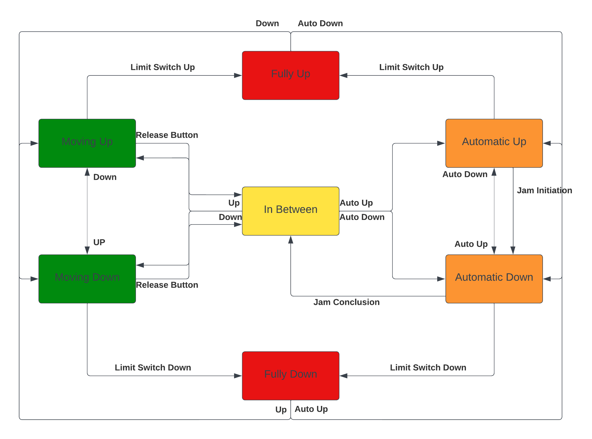

# CSE411 | Real-Time and Embedded Systems Design

## Project Documentation   Spring 2023

## Power window control system using Tiva C running FreeRTOS

## Instructor:     Prof. Dr. Sherif Hammad

## TA:     Eng. Mohamed Tarek

- [Project Architecture](#project-architecture)
  - [Hardware Used](#hardware-used)
  - [FreeRTOS Data Structures Used](#freertos-data-structures-used)
  - [Layers](#layers)
  - [System Connection with the Microcontroller](#system-connection-with-the-microcontroller)
    - [Motor unit](#motor-unit)
    - [Limit Switches](#limit-switches)
    - [Driver Side Panel](#driver-side-panel)
    - [Passenger Side Panel](#passenger-side-panel)
    - [Automatic Jamming](#automatic-jamming)
  - [Project Schematic](#project-schematic)
- [Application Description](#application-description)
  - [State Diagram](#state-diagram)
  - [Created Tasks](#created-tasks)
  - [Handling Corner Cases](#handling-corner-cases)

# Project Architecture

## Hardware Used

1. Microcontroller: TM4C123
2. Breadboard
3. 2 DC Motors
4. Motor Driver Module
5. 4 Limit Switches
6. ON/OFF Switch
7. 8 Push Buttons
8. Jumper cables
9. Resistances
10. 9v Power Supply

## FreeRTOS Data Structures Used

- 4 Queues
- 4 Semaphores
- 4 Mutex Locks

## Layers

|Layer Name|Contents|
|:-----------------------------:|:--------------------------:|
|MCAL|Peripherals: A, C, D, and E|
|HAL|DC Motor, Motor Driver Module, Limit Switches, ON/OFF Switches, and Push buttons|
|Application|Manual open/close, One touch auto open/close, Window lock, and Jam protection|

## System Connection with the Microcontroller

### Motor unit

|Hardware Part|Function|Connection|
|:------------:|:-----------------------------:|:--------------------------:|
|DC Motor 1|Move Driver Window Up|Port:B Pin:0 |
|DC Motor 1|Move Driver Window Down|Port:B Pin:1 |
|DC Motor 2|Move Passenger Window Up|Port:B Pin:2 |
|DC Motor 2|Move Passenger Window Down|Port:B Pin:3 |
|DC Motor 1|PWM Control|Port:B Pin:6 |
|DC Motor 2|PWM Control|Port:B Pin:7 |

### Limit Switches
|Hardware Part|Function|Connection|
|:------------:|:-----------------------------:|:--------------------------:|
|Limit Switch 1|Stop Driver Window When It Reaches Upper Limit|Port:D Pin:6 |
|Limit Switch 2|Stop Driver Window When It Reaches Lower Limit|Port:D Pin:7 |
|Limit Switch 3|Stop Passenger Window When It Reaches Upper Limit|Port:D Pin:2 |
|Limit Switch 4|Stop Passenger Window When It Reaches Lower Limit|Port:D Pin:3 |

### Driver Side Panel
|Hardware Part|Function|Connection|
|:------------:|:-----------------------------:|:--------------------------:|
|PushButton 1|Move Driver Window Up|Port:A Pin:2 |
|PushButton 2|Move Driver Window Down|Port:A Pin:3 |
|PushButton 3|Move Passenger Window Up|Port:E Pin:1 |
|PushButton 4|Move Passenger Window Down|Port:E Pin:2 |
|ON/OFF Switch|Window Lock for all Windows Except Driver's|Port:A Pin:5 |

### Passenger Side Panel
|Hardware Part|Function|Connection|
|:------------:|:-----------------------------:|:--------------------------:|
|PushButton 1|Move Passenger Window Up|Port:E Pin:4 |
|PushButton 2|Move Passenger Window Down|Port:E Pin:5 |

### Automatic Jamming
|Hardware Part|Function|Connection|
|:------------:|:-----------------------------:|:--------------------------:|
|PushButton 1|Jam Control on Driver's Window|Port:C Pin:4 |
|PushButton 2|Jam Control on Passenger's Window|Port:C Pin:5 |

## Project Schematic

# Application Description

## State Diagram

## Created Tasks

1. Driver Task
     - This Task is a Low Priority Task.
     - This Task is used to control the driver side window.
     - This Task waits for an external Interrupt i.e. the window up/down button.
     - Initially the task attempts to take Semaphore which forces it to enter blockage state.
     - Upon Interrupt, the Semaphore is given from the ISR along with a message from the Queue telling the Task the action to be taken.
     - When handling Motor 1 state a Mutex Lock is first acquired then the state is changed then the Lock is released.

2. Passenger Task
     - This Task is the Lowest Priority Task.
     - This Task is used to control the passenger side window.
     - This Task is shared between the driver and passenger panels.
     - This Task waits for an external Interrupt i.e. the window up/down button.
     - Initially the task attempts to take semaphore which forces it to enter blockage state.
     - Upon Interrupt, the Semaphore is given from the ISR along with a message from the Queue telling the Task the action to be taken.
     - When handling Motor 2 state, a Mutex Lock is first acquired then the state is changed then the Lock is released.
  
3. Limit Task
      - This Task is the Highest Priority Task.
      - This Task is used to control the driver and passenger side windows' limits.
      - This Task is shared between the driver and passenger windows.
      - This Task waits for an external Interrupt i.e. the window fully up/down switch.
      - Initially the task attempts to take semaphore which forces it to enter blockage state.
      - Upon Interrupt, the Semaphore is given from the ISR along with a message from the Queue telling the Task the action to be taken.
      - When handling Motor 1/2 states, a Mutex Lock is first acquired then the state is changed then the Lock is released.

4. Jamming Task
     - This Task is a High Priority Task.
     - This Task is used to protect from jamming by automatically stopping the power window and moves it downward about 0.5 seconds if foreign matter gets caught in window during one touch auto close operation.
     - This Task is shared between the driver and passenger windows.
     - This Task waits for an external Interrupt i.e. the window fully up/down switch.
     - Initially the task attempts to take semaphore which forces it to enter blockage state.
     - Upon Interrupt, the Semaphore is given from the ISR along with a message from the Queue telling the Task the action to be taken.
     - When handling Motor 1/2 states, a Mutex Lock is first acquired then the state is changed then the Lock is released.

## Handling Corner Cases

1. If driver pressed up and down on driver window simultaneously
     - The button which was pushed first will be executed, then if it was released and the other is still pressed it will change direction.

2. If driver pressed up on passenger window and passenger pressed down
     - The first one to push will be executed.

3. If the window is going up and down limit switch fired an interrupt or vice versa
      - Nothing will happen as the only option to stop the window while going up is either to release the up button or an interrupt fired from the up limit switch.

4. On/Off switch
      - Closes the control to the passenger window from both passenger and driver panel.
