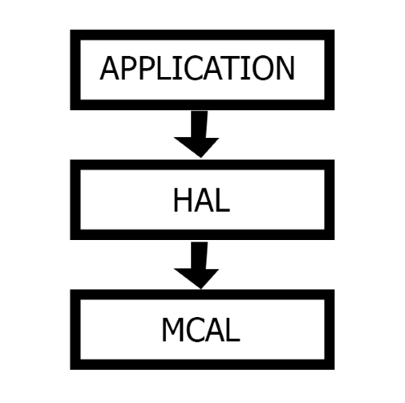
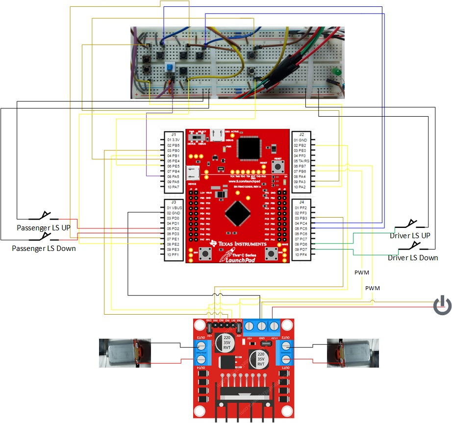

# CSE411 | Real-Time and Embedded Systems Design

## Project Documentation   Spring 2023

## Power window control system using Tiva C running FreeRTOS

## Instructor:     Prof. Dr. Sherif Hammad

## TA:     Eng. Mohamed Tarek

- [Project Architecture](#project-architecture)
  - [Hardware Used](#hardware-used)
  - [FreeRTOS Data Structures Used](#freertos-data-structures-used)
  - [Layers](#layers)
  - [System Connection with the Microcontroller](#system-connection-with-the-microcontroller)
    - [Motor unit](#motor-unit)
    - [Limit Switches](#limit-switches)
    - [Driver Side Panel](#driver-side-panel)
    - [Passenger Side Panel](#passenger-side-panel)
    - [Automatic Jamming](#automatic-jamming)
  - [Project Schematic](#project-schematic)
- [Application Description](#application-description)

# Project Architecture

## Hardware Used

1. Microcontroller: TM4C123
2. Breadboard
3. 2 DC Motors
4. Motor Driver Module
5. 4 Limit Switches
6. ON/OFF Switch
7. 8 Push Buttons
8. Jumper cables
9. Resistances
10. 9v Power Supply

## FreeRTOS Data Structures Used

1. Queues
2. Semaphores
3. Mutex Locks

## Layers

|Layer Name|Contents|
|:-----------------------------:|:--------------------------:|
|MCAL|Peripherals: A, C, D, and E|
|HAL|DC Motor, Motor Driver Module, Limit Switches, ON/OFF Switches, and Push buttons|
|Application|Manual open/close, One touch auto open/close, Window lock, and Jam protection|

## System Connection with the Microcontroller

### Motor unit

|Hardware Part|Function|Connection|
|:------------:|:-----------------------------:|:--------------------------:|
|DC Motor 1|Move Driver Window Up|Port:B Pin:0 |
|DC Motor 1|Move Driver Window Down|Port:B Pin:1 |
|DC Motor 2|Move Passenger Window Up|Port:B Pin:2 |
|DC Motor 2|Move Passenger Window Down|Port:B Pin:3 |
|DC Motor 1|PWM Control|Port:B Pin:6 |
|DC Motor 2|PWM Control|Port:B Pin:7 |

### Limit Switches
|Hardware Part|Function|Connection|
|:------------:|:-----------------------------:|:--------------------------:|
|Limit Switch 1|Stop Driver Window When It Reaches Upper Limit|Port:D Pin:6 |
|Limit Switch 2|Stop Driver Window When It Reaches Lower Limit|Port:D Pin:7 |
|Limit Switch 3|Stop Passenger Window When It Reaches Upper Limit|Port:D Pin:2 |
|Limit Switch 4|Stop Passenger Window When It Reaches Lower Limit|Port:D Pin:3 |

### Driver Side Panel
|Hardware Part|Function|Connection|
|:------------:|:-----------------------------:|:--------------------------:|
|PushButton 1|Move Driver Window Up|Port:A Pin:2 |
|PushButton 2|Move Driver Window Down|Port:A Pin:3 |
|PushButton 3|Move Passenger Window Up|Port:E Pin:1 |
|PushButton 4|Move Passenger Window Down|Port:E Pin:2 |
|ON/OFF Switch|Window Lock for all Windows Except Driver's|Port:A Pin:5 |

### Passenger Side Panel
|Hardware Part|Function|Connection|
|:------------:|:-----------------------------:|:--------------------------:|
|PushButton 1|Move Passenger Window Up|Port:E Pin:4 |
|PushButton 2|Move Passenger Window Down|Port:E Pin:5 |

### Automatic Jamming
|Hardware Part|Function|Connection|
|:------------:|:-----------------------------:|:--------------------------:|
|PushButton 1|Jam Control on Driver's Window|Port:C Pin:4 |
|PushButton 2|Jam Control on Passenger's Window|Port:C Pin:5 |

## Project Schematic

# Application Description

